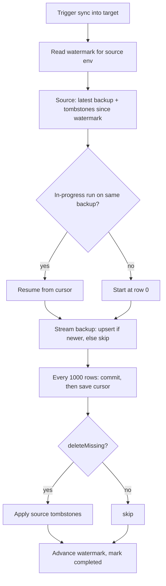

# Fast Env Sync — human guide

**Audience:** infra / devs who sync one environment's DB into another
**Design / code:** `ModuleBE_SyncEnv` (backend), `sync-env/apis.ts` (contract), `ModuleFE_SyncEnvV2` (frontend)
**Naming:** "sync" here means pulling a source env's data into a target env from a backup snapshot — not live replication.

---

## Motivation

Pulling prod's DB into local (or any env → env) used to be **brute-force**: stream the entire backup and rewrite **every** document. It's expensive (mass reads/writes), slow, and it runs inside a serverless function with a hard time limit — so a large sync can be **killed mid-way with nothing to show** and no way to continue except starting over.

Fast Env Sync makes it a **change-tracked, resumable delta**: apply only what changed since last time, optionally mirror deletions, and checkpoint progress so the time limit stops being a wall.

---

## What it is

Each target env remembers **how far it already synced** from a given source (a **watermark**). The next sync streams the source's latest backup but only applies documents changed **after** the watermark; unchanged docs are skipped entirely. Deletions at the source can be mirrored too. Long runs **checkpoint** their position and **resume** where they left off.

Think **incremental pull** of a whole database from a snapshot — not a live mirror.

---

## Vocabulary

| Term | Meaning |
|------|---------|
| **Source env** | The env you sync **from** (e.g. prod). Exposes a read-only feed; never modified. |
| **Target env** | The env you sync **into** (e.g. local). Runs the apply. |
| **Backup** | Immutable CSV snapshot of the source DB at a point in time — already produced by the platform. |
| **Watermark** | The source backup timestamp the target **last fully applied**. The high-water mark for "what's new." |
| **Delta apply** | Streaming the backup and upserting only docs whose `__updated` is newer than the watermark; the rest are skipped. |
| **Tombstone** | A delete marker for a doc removed at the source. |
| **Cursor** | How many backup rows the current run has consumed — the resume point. |
| **SyncProgress** | Live status of an in-flight / last sync: running · completed · failed, plus counts and cursor. |

---

## Mental model

```
Source backup (CSV snapshot, ordered)      Target env
┌──────────────────────────────┐
│ row 0   docA  __updated=105   │──▶ newer than watermark → UPSERT
│ row 1   docB  __updated= 90   │──▶ ≤ watermark          → SKIP (no read/write)
│ row 2   docC  __updated=110   │──▶ newer                → UPSERT
│  ...                          │
└──────────────────────────────┘
        watermark = 100
        tombstones since 100:  docX, docY  ──▶ DELETE locally (if enabled)

after success:  watermark ← this backup's timestamp
```

- Only docs changed since the watermark cost anything — that's what makes repeat syncs cheap.
- The backup is a fixed snapshot, so **row order is stable** — the row cursor is a reliable resume point.

---

## How a sync runs

```
1. Read the watermark for this source env      (none → full import from 0)
2. Ask the source for its latest backup + tombstones-since-watermark
3. Stream the backup:
     for each row:
       advance cursor
       if row.__updated > watermark → upsert   else → skip
       every 1000 rows: commit batch, THEN save cursor
4. If "delete missing": apply the source tombstones locally
5. On full success: advance the watermark to this backup's timestamp; mark completed
```

Steps 2–4 are the only work; step 1 and 5 are cheap bookkeeping.

---

## Resume & the time limit

The whole apply runs inside one serverless function with a hard ceiling (~60 min). A big first import can exceed it. The **cursor** makes that survivable:

```
Cursor is saved every 1000 rows, always AFTER the batch commits
  → the saved position never runs ahead of persisted writes
  → a hard timeout-kill loses at most one in-flight batch

Re-trigger the same env:
  IF a run is "in-progress" on the SAME backup → resume from cursor (skip consumed rows)
  ELSE                                          → start fresh at row 0
  forceFull                                     → ignore progress, re-import from 0
```

Resume is **manual** (re-trigger / a Resume action in the UI). Raising the function's time budget is a secondary optimization — correctness comes from the cursor, not the timeout.

---

## Capabilities

| Capability | What it does | Runs on |
|------------|--------------|---------|
| **Latest-backup feed** (`getLatestBackupDelta`) | Hands back the latest backup to stream + the tombstones deleted since the caller's watermark. One round trip covers upserts **and** deletes. Cheap. | **Source** |
| **Delta sync trigger** (`syncLatestFromEnv`) | Reads watermark → pulls the feed → runs / resumes the delta apply → advances watermark on success. | **Target** |
| **Progress readout** (`getSyncStatus`) | Reports the live `SyncProgress` so the UI can show a running sync and offer Resume. | **Target** |
| **`deleteMissing` flag** | Mirror source deletions (off = upserts only). | Target |
| **`forceFull` flag** | Ignore the watermark/progress and re-import everything. | Target |

---

## Key indicators

- **Watermark** — the cost/safety lever: repeat syncs stay cheap, and because it advances **only on full success**, an interrupted sync never creates a silent gap.
- **SyncProgress** — the observability + resume lever: what's running, how far, and whether the last run finished or failed.

---

## Data flow



---

## Guarantees

- **No silent gaps** — watermark advances only after a fully successful apply.
- **Crash-safe resume** — cursor is never ahead of committed writes; a kill resumes cleanly.
- **Idempotent** — re-applying overwrites; re-runs are safe.
- **Source is read-only** — sync never writes to the source env.
- **Backwards compatible** — the target fails fast if the source lacks the feed; deploy the source capability to prod first.
- **Env guards** — never sync a non-prod source into prod; honor the env allow-list.

---

## Scope

**Shipped:** delta engine + watermark; source feed (`getLatestBackupDelta`); target trigger (`syncLatestFromEnv`); ATS toggles (`delta` / `deleteMissing` / `forceFull`).

**Not shipped:** `SyncProgress` cursor + resume + `getSyncStatus`; the new methods on `ModuleFE_SyncEnvV2`; an ATS "fast sync" action wired to `syncLatestFromEnv`; the defaulted KM App-Tools button; tests for tombstone gathering + apply orchestration; deploying the source feed to prod.

---

## What this is not

- **Not live replication** — it applies a point-in-time backup snapshot, not a continuous mirror.
- **Not a backup producer** — it consumes backups the platform already makes.
- **Not automatic** — syncs (and resumes) are triggered, not scheduled.
- **Not a full copy every time** — unchanged docs are skipped; only the delta is applied.
